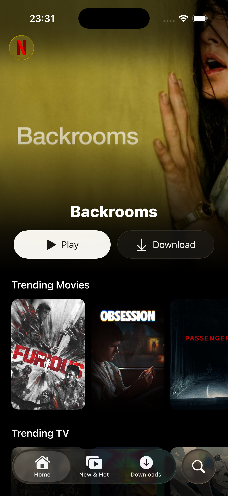
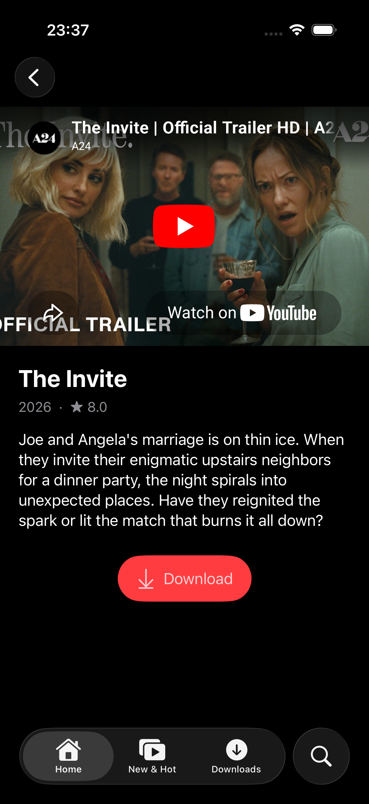
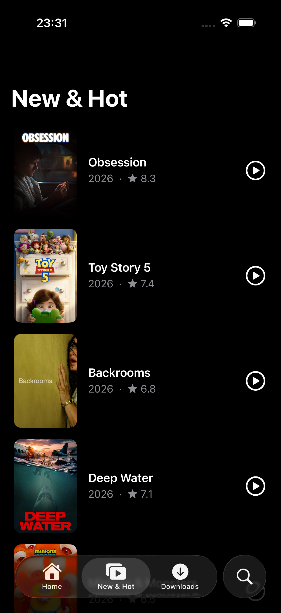
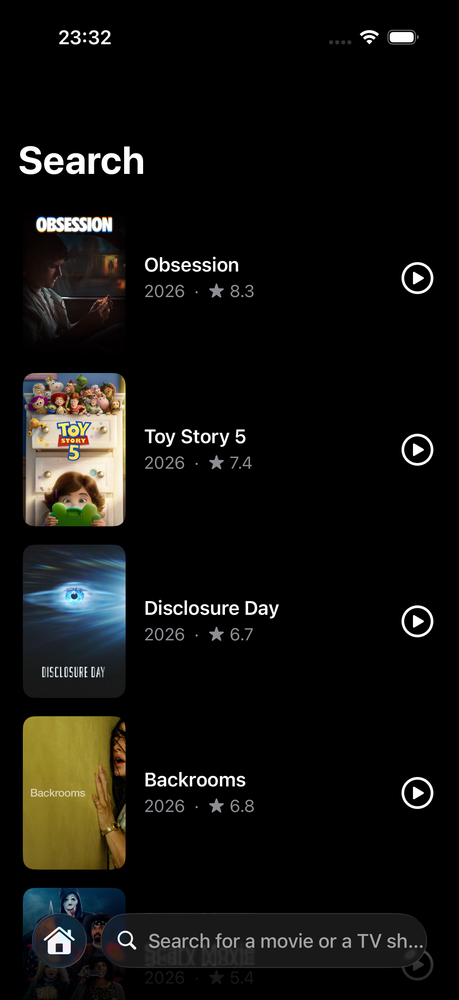
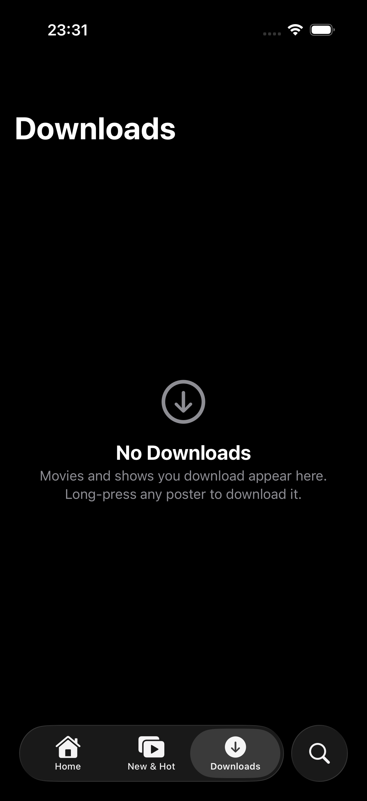

# Netflix Clone — iOS 26 · UIKit · Liquid Glass

A Netflix-inspired iOS app built with **UIKit**, modernized for **iOS 26** with the new **Liquid Glass** design language. Browse trending movies and TV shows, watch trailers, search the TMDB catalog, and save titles for offline viewing.


## Screenshots

| Home | Preview & Trailer | New & Hot |
|:---:|:---:|:---:|
|  |  |  |

| Search | Downloads (empty state) |
|:---:|:---:|
|  |  |

## Features

- **Home feed** — five curated rows (Trending Movies, Trending TV, Popular, Upcoming, Top Rated) fetched **concurrently** with Swift structured concurrency, plus pull-to-refresh
- **Hero header** — a random trending title with Liquid Glass *Play* and *Download* buttons over a gradient poster
- **Trailer preview** — tap any poster to watch the YouTube trailer in-app; falls back to poster art when no embeddable trailer exists
- **Search** — live search with debouncing over the TMDB catalog, presented through the iOS 26 tab-bar search field
- **Downloads** — long-press any poster (or use the preview screen) to save a title to Core Data; swipe to delete; system empty state when the list is empty
- **Haptics, error alerts, duplicate-download protection** — small touches that make it feel like a real app

## iOS 26 / Modern APIs Used

| API | Where |
|---|---|
| `UIButton.Configuration.glass()` / `.prominentGlass()` | Hero header & preview download button |
| `UITab` + `UISearchTab` | Floating Liquid Glass tab bar with morphing search field |
| Swift Concurrency (`async/await`, `withTaskGroup`, task cancellation) | Networking layer & all view controllers |
| `UIContentUnavailableConfiguration` | Downloads empty state |
| `UIListContentConfiguration` | Home section headers |
| Core Data (`NSPersistentContainer`) | Offline downloads store |
| [SDWebImage](https://github.com/SDWebImage/SDWebImage) | Async image loading & caching |

## Architecture

MVVM with a clear separation of concerns:

```
NetflixClone
├── Controllers
│   ├── Core          # Home, New & Hot, Search, Downloads, TabBar
│   └── General       # TitlePreview, SearchResults
├── Managers
│   ├── APICaller     # async/await TMDB + YouTube client (typed endpoints & errors)
│   └── DataPersistenceManager   # Core Data stack + downloads CRUD
├── Models            # Codable API models (Title, YoutubeSearchResponse)
├── ViewModels        # TitleViewModel, TitlePreviewViewModel
└── Views             # HeroHeader, poster cells
```

Highlights:

- **Single-fetch feed** — each home section is fetched once and cached in the controller; cells only render data (no network calls in `cellForRowAt`)
- **Typed endpoints** — `APICaller.TitlesEndpoint` enum builds URLs with `URLComponents`, no string interpolation of queries
- **Bridged models** — Core Data items convert back to the `Title` API model, so every screen shares the same view models

## Getting Started

### Requirements

- Xcode 26+
- iOS 26.0+ simulator or device

### Setup

1. Clone the repository:
   ```bash
   git clone https://github.com/ahmedhalilovic/NetflixClone.git
   ```
2. Open `NetflixClone.xcodeproj` in Xcode — Swift Package Manager resolves SDWebImage automatically.
3. Copy `NetflixClone/Managers/Secrets.swift.example` to `NetflixClone/Managers/Secrets.swift` (gitignored) and add your own keys:
   - **TMDB** key: [themoviedb.org/settings/api](https://www.themoviedb.org/settings/api) (free)
   - **YouTube Data API v3** key: [Google Cloud Console](https://console.cloud.google.com/apis) (free, quota-limited — trailers gracefully fall back to poster art if unavailable)
4. Add `Secrets.swift` to the `NetflixClone` target in Xcode (drag it into the `Managers` group if it doesn't show up automatically).
5. Build & run.

## Credits

- Movie & TV data from [TMDB](https://www.themoviedb.org). This product uses the TMDB API but is not endorsed or certified by TMDB.
- Trailers via the [YouTube Data API](https://developers.google.com/youtube/v3).

## Author

**Ahmed Halilovic**
